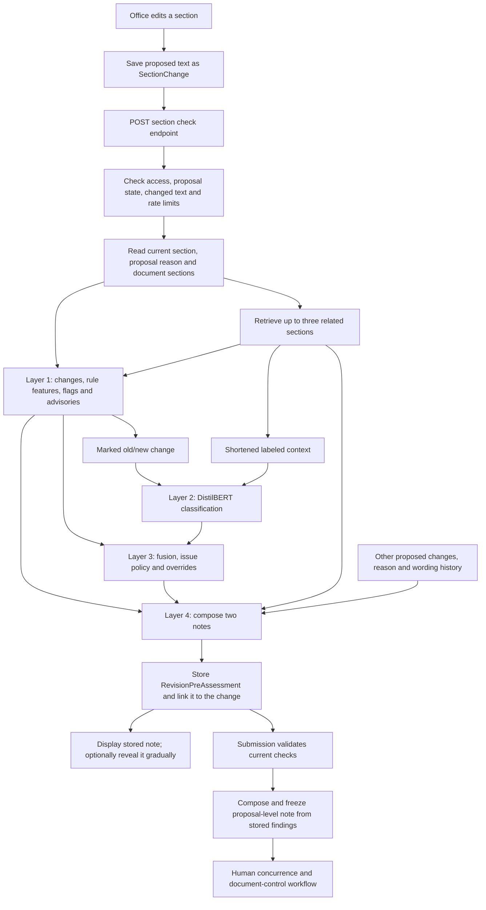

# HMRAP: current implementation, specifications and capability boundaries

Date: 1 October 2026. Reviewed application commit: `1c53fa6`.
Scope: the current proposal-section checking path, its trained artifacts, its
explanation layer, and the committed evaluation records. This is a technical
description, not a new model evaluation or a claim of ISO certification.

## 1. Description

HMRAP means **Hybrid Multi-Layer Revision Assessment Pipeline**. It is a local
revision-assessment system for DocuRoute's controlled documents. It compares a
section's existing text with its proposed replacement, consults selected related
sections of the same document, and produces findings and a readable advisory note.

It combines four different mechanisms:

1. Deterministic rules and controlled vocabulary extract observable changes.
2. A fine-tuned DistilBERT classifier predicts an internal verdict and issue labels.
3. A gradient-boosting classifier combines rule features with model probabilities;
   separate policy code selects issues and applies overrides.
4. A deterministic prose-composition engine turns findings and supplied text into
   a drafter-facing and a reviewer-facing explanation.

The conversational experience comes from Layer 4 and the browser's gradual reveal.
There is no generative language-model decoder or remote chat-model call in this
assessment path. The model does not write the note, search the web, or train itself
when people use the application.

The assessment is advisory. `approve`, `needs_revision`, `reject`, and confidence
remain internal fields; the proposal UI presents prose. Human concurrence, paper
signing and QMS decisions control the document's workflow. Submission requires
current section checks and an acceptable reason, not an AI `approve` verdict.

## 2. End-to-end flow



The request is `POST /api/proposals/{proposal_id}/sections/{section_id}/check/`.
`check_section()` calls `_assess_unsaved()`, which calls `assess_texts()`.
Despite the helper's name, this UI path checks the already saved `change.new_text`.
The frontend requires saving local edits before running another check.

Main assessment inputs:

| Input | Use |
|---|---|
| Current section text | Baseline for rules and marked changes |
| Saved proposed section text | Replacement being assessed |
| Section number and title | Model input label and explanation location |
| Overall proposal reason, falling back to the section note | Reason-quality rules and explanatory wording |
| Related current-manual sections | Cross-reference rules, model context and named references in notes |
| Other changed sections' old/new text | Layer 4 coordination wording only |
| Previous wording choices | Variation of prose only |

The active helper reads the baseline from `section.content`; `SectionChange`
also retains `old_text` for the proposal's comparison and its own freshness hash.
These are distinct records, not a single combined full-manual snapshot supplied
to the model.

## 3. Preprocessing and evidence extraction

`diffing.py` supplies word and line comparison with `difflib.SequenceMatcher`,
insertion/deletion ratios, marked text, sentence matching and unit alignment.

Example representation:

```text
The office shall retain records for [DEL] 30 [/DEL] [INS] 60 [/INS] days.
```

Unchanged surrounding words remain where the input budget allows. Net deletion
uses word counts rather than positional movement, so rearranging existing text
does not automatically count as deleting it. Sentence-removal matching and unit
alignment use a default similarity cutoff of 0.6 and one-to-one matching.

For table rows, unit alignment uses the last cell's step text to match a row
before and after a revision. This lets a changed responsibility cell remain
attached to the same step. Rules then compare matched units as well as whole
sections, catching reassignment of a step to a role already named elsewhere.

The frontend grid still serializes the existing pipe-delimited text format.
HMRAP operates on text, not a spreadsheet object, Word layout, image or merged-cell
model. Its table awareness is text/row awareness.

Six special tokens are registered: `[DEL]`, `[/DEL]`, `[INS]`, `[/INS]`, `[ROLE]`,
`[STEP]`. The current `marked_text()` path emits the four change markers. I did
not find an active transformation inserting `[ROLE]`/`[STEP]` in this checking
path; their registration alone does not prove structured table encoding.

## 4. Layer 1 — deterministic rule assessment

Main component: [layer1_rules.py](../revision_pipeline/layer1_rules.py).

Layer 1 returns a `Layer1Result` with rule features, evidence-bearing flags,
hard failures, advisories, change type and marked text.

### 4.1 Trained issue categories

| Label | What it identifies | Important boundary |
|---|---|---|
| `excessive_deletion` | More than 40% net wording removed | A size threshold, not a judgment that the removed content was necessary |
| `key_term_deleted` | Known systems/forms or canonical legal references lost | Depends on vocabulary and supported citation patterns |
| `modal_weakened` | Obligatory wording replaced by permissive wording | Requires both obligation loss and permission gain |
| `negation_changed` | Negation changes or configured sense reversals | Includes pairs such as before/after and minimum/maximum; not unrestricted semantic reasoning |
| `numeric_changed` | Changes to quantities, durations, frequency words and recognized references | Normalization reduces renumbering and role-suffix noise |
| `responsibility_changed` | Known roles/offices changed, including within a matched step | Depends on role vocabulary and row/unit matching |
| `requirement_removed` | Sentence/unit removal evidence | A removed sentence is not necessarily a removed mandatory requirement |
| `non_equivalent_term` | Controlled glossary substitutions changing meaning | Unknown substitutions are not automatically known equivalents |
| `contradicts_manual` | Old numeric/role tokens still present in retrieved sections | A possible conflict based on text occurrence, not proof of logical incompatibility |
| `out_of_scope_content` | Model-predicted scope mismatch | No equivalent direct Layer 1 rule flag |

Obligation vocabulary includes shall, must, will, should, and required-to phrases.
Permissive vocabulary includes may, can, could, might, encouraged-to and optional.
These are the project's configured interpretations, not a complete grammar.

Change types are `cosmetic`, `terminology_equivalent`,
`terminology_non_equivalent`, and `substantive`.

### 4.2 Fourteen rule features

1. `deleted_line_ratio`
2. `deleted_word_ratio`
3. `inserted_word_ratio`
4. `net_deleted_word_ratio`
5. `sentences_removed`
6. `key_terms_deleted_count`
7. `modal_weakened_count`
8. `negation_changed`
9. `numeric_changed_count`
10. `role_terms_changed_count`
11. `equivalent_swaps`
12. `non_equivalent_swaps`
13. `unknown_swaps`
14. `cross_ref_conflict_count`

The order is fixed because fusion consumes a flat numeric vector.

### 4.3 Vocabulary and reason checks

`entities.json` currently contains 99 roles, 28 offices, 64 systems and 54 forms.
The loader filters very short phrases; file counts are not counts of effective
rules. Roles/offices support responsibility checking; systems/forms support
key-term checking. `glossary.txt` supplies symmetric equivalent/non-equivalent
term pairs. Optional manual-specific key terms are supported by `assess_texts`,
but the current proposal helper does not supply that optional argument.

`change_reason.py` distinguishes missing, invalid, weak and acceptable reasons.
Configured minimums are 15 characters, three words and three distinct alphanumeric
characters. Repeating the section title can be invalid. Fewer than two meaningful
content words makes a reason weak after basic validation.

Missing/invalid reasons, empty revisions and normalized-identical revisions are
Layer 1 hard failures. The API already refuses checks on changes it considers
unchanged. A weak reason produces an advisory that can affect the internal verdict.

Reason text is not an input to DistilBERT. Layer 4 has a limited term-overlap
observation about whether the reason mentions the main change; it does not verify
the reason's truth or establish semantic justification.

### 4.4 Explanation-only checks

These execute in the Layer 1 call but sit outside the trained feature/label space.
They carry `affects_verdict: False`; fusion passes them to Layer 4.

| Advisory | Component and method | Boundary |
|---|---|---|
| Unknown word | `advisory_checks.py`, pyspellchecker plus manual/entity/glossary vocabulary | Checks newly introduced lowercase words of at least three letters; skips several name/acronym/URL cases; not full proofreading |
| Inconsistent terminology | Single-word substitutions where the old term remains elsewhere in the section | Local heuristic, not terminology auditing across every section |
| Unfinished sentence | Changed-line/numbered-item ending and opening heuristics | Not a grammar parser |
| Added requirement | New sentences containing recognized obligation words, or permissive-to-obligatory swaps | Makes additions visible without retraining the ten-label classifier |
| Malformed citation/text | `malformed.py`, checks introduced broken abbreviations/citations, acronym context and bracket faults | Recognizes specific damage patterns, not legal validity |

These checks focus on faults introduced by the edit rather than blaming users
for every pre-existing extraction problem. Missing pyspellchecker disables the
spelling advisory while the other checks remain available.

## 5. Layer 2 — context-aware DistilBERT classifier

Main component: [layer2_model.py](../revision_pipeline/layer2_model.py).

| Specification | Current value |
|---|---|
| Base encoder | `distilbert-base-uncased` |
| Transformer layers | 6 |
| Attention heads per layer | 12 |
| Hidden width | 768 |
| Feed-forward width | 3072 |
| Saved vocabulary size | 30,528, including the six added tokens |
| Saved weight dtype | float32 |
| Encoder positional capacity | 512 |
| Actual pipeline input limit | **384 tokens total** |
| Task-head dropout | 0.1 |
| Verdict output | 3 logits, softmax probabilities |
| Issue output | 10 logits, independent sigmoid probabilities |
| Training objective | Weighted cross-entropy + weighted binary cross-entropy |
| Issue loss multiplier | 1.0 |

Both linear heads read the shared encoder's first-token representation after
dropout. Multiple issues can be predicted for one revision; verdict classes are
mutually exclusive.

Text A is the section label plus the marked change. Text B is labeled retrieved
context with the document title. Context formatting first limits it to roughly
1,200 characters. Tokenization then fits both texts and special tokens into 384
tokens, preferentially shortening Text B.

When Text A alone is too long, `_window_around_change()` selects windows near the
first and last change markers. This prioritizes change evidence, but it is not a
sliding-window pass over the entire section: middle content and intermediate
changes can be omitted in a long revision. Descriptions saying the revision is
"never cut" are too broad for that case.

### Current model issue thresholds

| Label | Threshold |
|---|---:|
| excessive_deletion | 0.85 |
| key_term_deleted | 0.75 |
| modal_weakened | 0.95 |
| negation_changed | 0.85 |
| numeric_changed | 0.90 |
| responsibility_changed | 0.85 |
| requirement_removed | 0.80 |
| non_equivalent_term | 0.80 |
| contradicts_manual | 0.90 |
| out_of_scope_content | 0.75 |

These are the local `thresholds.json` values, documented as medians of per-fold
validation thresholds. They select labels; they are not guarantees that a finding
is correct with the corresponding percentage probability.

## 6. Layer 3 — fusion, issue selection and overrides

Main component: [layer3_fusion.py](../revision_pipeline/layer3_fusion.py).

The saved fusion model is a scikit-learn `HistGradientBoostingClassifier`.
Its input has **31 values**:

```text
14 rule features + 4 one-hot change types
+ 3 model verdict probabilities + 10 model issue probabilities
= 31 fusion inputs
```

It predicts verdict probabilities. The highest probability supplies the initial
internal verdict. The issue list is chosen separately, using `rules_precise`:

```text
reported issues = thresholded model issues
                + rule flags for excessive_deletion,
                  modal_weakened, non_equivalent_term
```

Those three rule labels passed the configured 0.90 precision floor during the
recorded fold analysis. The policy avoids adding every noisy rule flag. A flag
excluded from the issue list can still affect fusion through its numeric feature;
Layer 4 can also use selected raw evidence. In particular, a cross-reference rule
flag is not automatically a displayed `contradicts_manual` issue.

Issues carry `rule`, `model`, or `both` provenance, severity, clause relevance,
confidence and available evidence. Model-only findings can have no exact evidence
span. A rule's confidence of 1.0 indicates the rule observed its condition, not
certainty that the edit is inappropriate.

Post-processing:

- A hard failure forces internal `reject` with rule-derived confidence.
- A high-severity issue supported by both sources prevents internal `approve`,
  changing it to `needs_revision` when necessary.
- Verdict-affecting advisories, notably a weak reason, can similarly change
  `approve` to `needs_revision`.
- Explanation-only spelling/terminology/sentence/addition advisories do not do so.

The stored confidence is not recalibrated after every override; therefore it
should not be presented as calibrated confidence in the final human decision.

## 7. Layer 4 — the readable note

Components: [layer4_explain.py](../revision_pipeline/layer4_explain.py),
[layer4_wording.yaml](../revision_pipeline/layer4_wording.yaml),
[ai_notes.py](../../api/ai_notes.py), and frontend `AiNote.jsx`.

Current wording metadata: **4.1**. Pipeline configuration version: **2.0.0**.
They describe different components and need not have the same version number.

The engine builds a structured representation of the observed edit, ranks findings,
chooses a significance tier and paragraph plan, fills phrase slots from evidence,
and composes plain prose. Tiers include blocking, serious, notable, tentative,
minor, trivial, plain and unclear.

Concern handling distinguishes:

- **Stated:** rule-supported observation.
- **Suggested:** model finding without contrary rule evidence.
- **Quiet:** a model finding whose corresponding rule check found no matching signal.

At most two concerns are developed in full. Other findings can be grouped or
summarized; the note is not a verbatim inventory of the entire trace. It can quote
an edit, identify its item/step, discuss why it warrants attention, mention related
sections, connect a concern to an ISO clause, and explain limitations.

Two notes are composed from the same assessment: one addresses the drafting
office; the other serves readers, concurring offices and QMS reviewers.

Phrase selection avoids recently used variants, consulting other sections of the
proposal and up to 20 recent notes for that user, with content-hash tie breaking.
Identical inputs and identical rotation state produce identical prose. Identical
text alone is not a universal guarantee when surrounding proposal/history changes.
Stored notes are read back rather than recomposed on every view.

`AiNote.jsx` reveals an already completed response at about 30 words per second
when requested for a new drafter note. It supports Show all and reduced-motion
preferences, and remembers seen note IDs in browser storage. This is a display
animation, not live token generation over SSE or a streaming model connection.

## 8. Multi-section checking: exact reach

### 8.1 Retrieval scope and implementation

`retrieval.py` builds an index for one `Manual` record: one document, not every
document in a manual series. It uses TF-IDF with English stop-word removal,
one- and two-word terms, sublinear term frequency, and cosine similarity.

The query is the proposed section text, falling back to the current text when
empty. It selects the top three positively similar eligible records. Exclusions
include the section itself and numbered parent/descendant relationships. Siblings
remain eligible. The hierarchy rule treats `4.0` as parent to `4.x`.

The module supports an optional MiniLM embedding backend, but the current proposal
helper uses the default **TF-IDF** path. This is not a deployed vector-database
search or a recursive reference graph. Explicit references do not override ranking.

### 8.2 What the selected sections are used for

| Consumer | Information received | Actual work |
|---|---|---|
| Layer 1 | Full retrieved text strings | Look for removed old numeric/role tokens still appearing elsewhere |
| Layer 2 | Shortened labeled context | Predict issues/verdict with contextual input |
| Layer 4 | Related labels/text plus other proposed section changes | Name related sections and qualify coordination wording |
| Proposal note | Stored findings from changed sections and their recorded related-section IDs | Summarize matching numeric moves and certain conflicts with unchanged sections |

The 1,200-character limit applies to the formatted model context, not the entire
Layer 1 cross-reference search. The model's 384-token shared budget can shorten it
further. Context is reconstructed in manual order, so retrieving three sections
does not mean the model receives useful text from all three.

The rule is token/substring matching. It does not prove that identical numbers
describe the same deadline, or that a role's continued appearance elsewhere is
inconsistent. It can produce false positives and miss semantic contradictions
that use different vocabulary.

Layers 1–3 use retrieved current-manual text, not a virtual manual with all proposed
changes applied. Layer 4 receives other proposed changes separately. Some section
wording recognizes coordination simply because the old conflicting token disappears
from another proposed section; that is weaker evidence than proving both changes
are equivalent.

### 8.3 Whole-proposal note

At submission, `compose_version_note()` gathers all changed sections' stored checks
and calls `compose_proposal_note()` for both audiences. This has broader scope than
one section's top-three retrieval, but narrower depth than a whole-document model
assessment.

It can identify a shared old figure replaced with a common new figure in multiple
sections, using stored numeric flags. It can also point out a previously identified
conflict in a retrieved section not included among the changes. It does not test
every pair of sections or rerun DistilBERT on their combined proposed text. It uses
selected findings; for example, consistent-figure composition stops after finding
one qualifying shared transition.

### 8.4 Illustrative cases, not new benchmark results

| Situation | Current capability |
|---|---|
| A changes 30 days to 60; retrieved B retains 30 days | Can raise possible conflict evidence |
| A and B both change 30 to 60 with numeric flags | Proposal note can recognize coordination |
| A and B independently change 30 to different new values | No dedicated exhaustive pairwise validator; existing rules/model may notice some cases |
| Related B ranks fourth | B is not selected for A's ordinary context check |
| A changes a step assignment within its own table | Unit-level rule matching can identify it |
| A affects B, which affects C | No recursive dependency traversal |
| A affects another document/manual | No cross-document assessment in this path |
| Added obligation conflicts with another section | Addition advisory exists; no guarantee of detecting its cross-section consequences |

### 8.5 Freshness and retrieval-cache limitations

`SectionChange.check_is_current` fingerprints that change's old/new text, not its
retrieved context or other proposed sections. Editing B does not invalidate A's
existing assessment merely because A used B. The overall reason is also excluded
from that per-change freshness hash, although the assessment snapshot stores a
reason-inclusive hash and submission validates the current overall reason.

The retrieval cache is keyed by document ID and backend, in memory and on disk.
`build_index()` reuses it without comparing current section contents. I found no
application invalidation hook in the inspected Python paths. An isolated in-memory
probe with synthetic sections confirmed that a second call with changed content
and the same key returns the old index. This demonstrates a freshness risk; it
does not establish which live documents, if any, currently have stale indexes.
`clear_cache()` clears memory only; a disk index can subsequently be loaded again.

Related text is also re-associated with current labels by string equality in the
proposal helper. Stale cached text can fail that match; duplicate section contents
can match multiple labels. These are implementation limits, not intentional extra
multi-section reasoning.

## 9. Persistence, workflow and runtime

`RevisionPreAssessment` stores proposed text, reason, verdict/confidence, change
type, issues, hard failures, advisories, both notes, wording choices, trace,
fingerprint/version, retrieved section IDs, user and assessment time. The change
points to its current assessment; readers normally consume the stored result.

The trace includes all Layer 1 data, Layer 2 probabilities or an unavailable marker,
Layer 3 probabilities/overrides/confidence source/fusion kind, and loading warnings.
It is useful for diagnosis but is not a transformer attention explanation or a
complete immutable snapshot of all retrieved text.

Configured check limits are 200 per user/hour and 80 per proposal/hour. The
proposal count query uses linked section-change assessments; these constants are
not a throughput guarantee. Assessments run synchronously in the API path.

Models/tokenizers are lazily loaded under a lock and cached per process/model path/
device. Default inference is CPU. Retrieval and dictionaries are cached as well.
New model files generally require clearing the model cache or restarting workers.

Fallback behavior needs precise wording:

| Available artifacts | Actual branch |
|---|---|
| Layer 2 and fusion | Normal learned pipeline |
| Layer 2 only | Layer 2 verdict probabilities, then policy/overrides |
| Neither | Rule-derived verdict/confidence, explanation still available |
| Fusion but no Layer 2 | Fusion still runs with zero-filled Layer 2 probability slots |

The last case is not a clean rules-only fallback, despite the pipeline module's
introductory description. Also, `rules_precise` still filters the issue list when
Layer 2 is absent, so fallback findings are narrower than all available raw flags.
Warnings and `trace.layer2` expose missing model availability.

List-of-Forms sections return `assessed: false`, no verdict and a not-assessed note.
They can still serve as retrieved context for another section.

Published runtime measurements in `EVALUATION.md` are 13.6 seconds cold, 0.3–0.5
seconds warm and roughly 680 MB resident memory on an i3-1215U CPU machine. These
are recorded measurements, not a fresh benchmark of the full current endpoint or
a service-level guarantee after every subsequent change.

## 10. Related system components

| Component | Role | Relationship to HMRAP |
|---|---|---|
| `ml/ocr_engine.py` | PDF/DOCX/image text extraction and cleanup; PyMuPDF/pymupdf4llm, python-docx, Tesseract paths | Upstream source quality; not another assessment layer |
| `ml/svm_model.py` | TF-IDF/LinearSVC section tagging | Separate section classifier, not the HMRAP verdict model |
| `api/views.py` | Manual ingestion/section operations | Supplies stored manual content |
| `api/proposal_views.py` | Draft saving, per-section checking, payloads | Main active assessment integration |
| `api/pre_assessment.py`, `api/models.py` | Hashing and assessment/change records | Bind stored results to section changes |
| `api/ai_notes.py` | Wording history, other proposed sections, submission note | Data preparation for Layer 4 |
| `api/concurrence_views.py` | Submission, versions, concurrence | Requires current checks; does not delegate human agreement to the AI |
| `api/documents.py` and document generators | DCR, full draft manual and concurrence documents | Downstream document generation, not AI reasoning |
| `StaffProposals.jsx`, `SectionContentEditor.jsx` | Editing, saving, check status and table grids | User interaction; existing text format retained |
| `AiNote.jsx` | Prose display and gradual reveal | Presentation of completed stored notes |

## 11. Training and evaluation

The committed evaluation records describe 2,762 generated revisions across 19
source documents, produced by 25 generators. Verdict distribution: 1,019 approve,
730 needs_revision, 1,013 reject. All rows have issue labels. Five-fold evaluation
groups by source document so edits from a test document are not training examples
for that fold.

Recorded Layer 2 training uses a single NVIDIA T4, three epochs, batch size 16,
learning rate 3e-5, and 384-token inputs. The local shipped checkpoint metadata
records best epoch 3 and 2,542 training examples. Cross-validation models and the
final deployment checkpoint are distinct; fold evaluation is not a fresh test of
the deployed checkpoint on real staff revisions.

Fusion is trained on fold validation predictions and evaluated on the corresponding
held-out test predictions. The deployment fusion is trained separately from the
pooled validation predictions. Dataset builders, grouped splits, training scripts,
threshold tuning, saved predictions and checksum manifests support reproducibility.

Current committed fold report:

| System | Mean verdict accuracy | Mean verdict macro-F1 | Mean issue micro-F1 |
|---|---:|---:|---:|
| Rules only | 0.791 | 0.788 | **0.664** |
| Model only | 0.951 | 0.946 | 0.853 |
| Full pipeline | **0.978** | **0.977** | **0.854** |

The rules-only issue figure in the current file is 0.664, not the 0.667 quoted in
an earlier conversation report. The headline full-pipeline figures remain the same.
These are means of fold scores. Pooled issue micro-F1 is 0.844, a different
aggregation. Recorded fusion accuracy depends on scikit-learn: 0.978 with 1.9.0
versus 0.975 with 1.6.0 in the documented reproductions.

Selected pooled per-label findings:

| Label | Precision | Recall | F1 |
|---|---:|---:|---:|
| modal_weakened | 0.991 | 1.000 | 0.996 |
| numeric_changed | 0.973 | 0.960 | 0.966 |
| responsibility_changed | 0.940 | 0.993 | 0.966 |
| contradicts_manual | 0.626 | 0.793 | 0.700 |
| out_of_scope_content | 0.624 | 0.947 | 0.753 |
| excessive_deletion | 0.536 | 1.000 | 0.698 |

The `contradicts_manual` figure measures that label on generated examples, not
recall across all possible cross-section dependencies in a real manual. It does
not separately measure retrieval coverage or whole-document consistency.

A 50-example, one-judge blind label audit recorded 44/50 verdict agreement and
47/50 exact issue-set agreement before generator fixes. It checks label quality;
it is not an independent real-world deployment accuracy measurement.

Reported harmless-edit failures include a duplicated word removal at 0.95,
near-synonym rewording at 0.997 and a clarifying sentence at 0.9997, all given
unfavorable internal verdicts. These illustrate distribution gaps and uncalibrated
confidence. Natural wording in Layer 4 does not repair those classification errors.

Neither the 0.978 nor 0.854 figure measures prose quality, spelling-advisory accuracy,
added-requirement advisory accuracy, proposal-note completeness or frontend quality.

## 12. ISO scope, fingerprint and interpretation

The code maps concerns to project paraphrases of clauses 6.3, 7.5.3 and 5.3.
Clause 7.5.2 metadata is deliberately left to document-control features. These are
relevance mappings, not retrieval from a standards corpus or verified compliance
decisions. The pipeline does not check external law updates or certify a manual.

Current configuration fingerprint: `6a6a5c667a3c4d11`.
It hashes selected configuration: version, ordered verdicts/issues, registered
tokens, maximum length and rule-feature order. It does **not** hash all rule code,
model weights, thresholds, glossary, retrieval behavior or wording. Thus it is a
compatibility indicator, not proof that all model behavior or evaluation results
are unchanged. Artifact checksums, code diffs and evaluation are separate evidence.

Some comments and earlier documentation overstate or lag the implementation:

- Rules do perform a narrow cross-reference check; saying they never consult
  context is too broad.
- The reason is not a model input, but Layer 4 now has a limited reason-link check.
- Registered table tokens do not prove they are emitted by the active input path.
- Very long revisions are windowed; the complete revised section is not always
  visible to the model.
- Missing Layer 2 does not always produce pure rules-only operation if fusion loads.

## 13. Verification performed for this report

- Read the active API path, rules, retrieval, model, fusion, wording engine,
  persistence/freshness checks, frontend presentation and evaluation records.
- Inspected local encoder configuration, label configuration, fusion configuration
  and per-label thresholds.
- Ran the project-venv `check_setup.py`: **Ready**; Layer 2, tokenizer and fusion
  successfully loaded; required packages and vocabulary files were present.
- Counted the 31 fusion inputs and the current entity-file categories.
- Confirmed retrieval-cache reuse with a synthetic in-memory probe using
  `use_disk=False`; no database records or real retrieval indexes were changed.

No retraining, full fold reevaluation, production-data mutation, backend behavior
change or frontend change was performed for this report. Published metrics above
are cited from existing records rather than presented as newly reproduced results.

## 14. Defensible description of the current capability

> HMRAP is a four-layer advisory pipeline that combines deterministic change
> analysis, a fine-tuned context-aware DistilBERT classifier, gradient-boosting
> fusion and evidence-grounded prose composition. It assesses individual section
> revisions using selected same-document context and adds limited observations
> across the changed sections of a proposal. It supports human review; it does
> not provide exhaustive whole-manual validation or autonomous document approval.

Primary evidence: [pipeline](../revision_pipeline/pipeline.py),
[configuration](../revision_pipeline/config.py),
[retrieval](../revision_pipeline/retrieval.py),
[proposal integration](../../api/proposal_views.py),
[assessment models](../../api/models.py),
[evaluation](EVALUATION.md), [fold results](fold_evaluation.md),
[per-label results](per_label_issue_f1.md),
[dataset card](../datasets/context_v2/DATASET_CARD.md).
